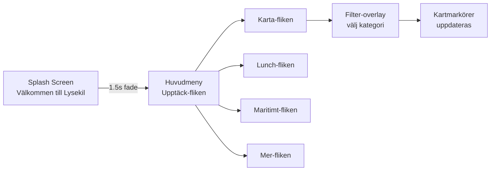

# Lysekil Guide App — Teknisk Roadmap & Informationsarkitektur

## 1. Rekommenderad Teknisk Stack

| Komponent | Teknik | Motivering |
|-----------|--------|------------|
| **Framework** | React Native (Expo) | Snabb utveckling, en kodbas för iOS/Android, stark community, utmärkt kartstöd via `react-native-maps`. |
| **Kartor** | `react-native-maps` (Apple/Google Maps) + offline tiles | Standardval för React Native; stöd för markörer, polygoner och offline-lager. |
| **Offline-lagring** | WatermelonDB / SQLite (via Expo) | Ska lagra vandringskartor, färjetider och basinformation lokalt. |
| **State-hantering** | Zustand | Minimal, reaktiv och perfekt för en app utan komplex autentisering. |
| **Navigation** | React Navigation (Bottom Tabs + Native Stack) | Industristandard, smidig övergång till huvudmenyn efter splash. |
| **Styling** | NativeWind (Tailwind för RN) | Snabb utveckling, konsekvent design, mobilanpassade utilities. |
| **API/Data** | REST/JSON från kommunens CMS (t.ex. Strapi/Contentful) eller egna endpoints. | Hämtar evenemang, restauranger, luncher. |

### Faser (Roadmap)
1. **Fas 0 — Setup:** Expo-projekt, design tokens, navigation, splash-screen.
2. **Fas 1 — Huvudstruktur:** Startsida, bottom-tab navigation, kategorier.
3. **Fas 2 — Karta:** Interaktiv karta, markörer, filter, offline-stöd för vandring.
4. **Fas 3 — Moduler:** Dagens lunch, färjetider, badplatser, gästhamn.
5. **Fas 4 — Polish:** Hållbarhet, miljöstationer, prestanda, tillgänglighet.

---

## 2. Informationsarkitektur (IA)

### Bottom-Tab Navigation (5 primära flikar)
```
┌─────────────┬─────────────┬─────────────┬─────────────┬─────────────┐
│   Upptäck   │    Karta    │   Lunch     │  Maritimt   │   Mer / Nav │
│   (Home)    │   (Map)     │  (Lunch)    │  (Maritime) │  (More)     │
└─────────────┴─────────────┴─────────────┴─────────────┴─────────────┘
```

**Flik 1: Upptäck (Startsida)**
- Hero: "Välkommen till Lysekil" + väder-widget.
- Snabbåtkomst-rutnät (6 stora klickytor): Evenemang, Butiker, Restauranger, Boende, Vandring, Service.
- Horisontell scroll: "Aktuellt just nu" (t.ex. Valborgsmässoafton, Hållbarhetsdagar).

**Flik 2: Karta**
- Fullskärmskarta med flytande filter-rad längst ner (eller överst).
- Filter: Butiker, Restauranger, Badplatser, Parkering, Toaletter, Bankomater, Laddstationer, Busshållplatser.
- Knapp: "Min position" + "Återställ filter".

**Flik 3: Dagens Lunch**
- Lista över restauranger med dagens rätt, pris, öppettider.
- Sortering: Närmast mig, Pris (lågt till högt), Betyg.

**Flik 4: Maritimt**
- Färjetider (Lysekil–Fiskebäckskil, realtidsuppdatering).
- Badplats-guide (brygga/strand/tillgänglighet, vattentemperatur).
- Gästhamnsinfo (platstillgänglighet, priser, bokning).

**Flik 5: Mer**
- Vandringsstråk (Stångehuvud m.fl.) med nedladdningsbara kartor.
- Miljöstationer & pantmaskiner.
- Inställningar (språk, tillgänglighet, offline-hantering).

---

## 3. Designsystem — "Bohuslänsk Minimalism"

### Färgpalett (hämtad från lysekil.se + natur)
| Token | Hex | Användning |
|-------|-----|------------|
| `--sea-blue` | `#005B7F` | Primära CTA, aktiva flikar, headers. |
| `--granite-grey` | `#5A5A5A` | Text, ikoner, subtila linjer. |
| `--rock-dark` | `#3D3D3D` | Rubriker, kontrasttext. |
| `--shell-white` | `#FAFAFA` | Bakgrund. |
| `--foam-white` | `#FFFFFF` | Kort, input-fält. |
| `--sand-beige` | `#F5F1EB` | Sekundär bakgrund, avdelare. |
| `--kelp-green` | `#4A7C59` | Hållbarhet, miljöstatus, framgång. |
| `--sunset-amber`| `#D4A017` | Varning, färjeavgångar "snart". |
| `--alert-red` | `#C0392B` | Stängt, fullbokat, fel. |

### Typografi
- **Rubriker:** `Inter` eller `Roboto` — Bold, 28–32px.
- **Brödtext:** `Inter` — Regular, 16px, radavstånd 1.5.
- **Etiketter:** `Inter` — SemiBold, 12px, uppercase, granitgrå.

### Komponenter
- **Klickytor:** Minst 48×48 dp (Google Material standard).
- **Kort:** Avrundade hörn (12px), subtil skugga (0 2px 8px rgba(0,0,0,0.06)).
- **Knappar:** Fyllda (`sea-blue`), fullbredd på mobil, 56px höga.
- **Ikoner:** `lucide-react-native` — tunna, skandinaviska linjeikoner.

---

## 4. Välkomstflöde & Interaktionsdesign



### Splash → Home
1. Appen öppnas. Vit bakgrund, Lysekils logotyp centrerad, text: "Välkommen till Lysekil".
2. Efter 1.5 sekunder: mjuk fade-out av logotyp, fade-in av hero-bild (t.ex. Stångehuvud) och snabbåtkomst-knappar.
3. Ingen inloggning, ingen onboarding. Direkt till innehåll.

---

## 5. Tre Unika Funktioner för Lysekil

### 5.1 "Kustväder + Badkoll"
Lysekils besökare tar sig till badplatser och klippor. En realtidswidget som visar:
- Vattentemperatur per badplats (uppskattad/historisk + sensor där tillgänglig).
- Vindstyrka & riktning (avgör om det är lämpligt för klippbad).
- UV-index och algblomningsvarning (viktigt för Bohusläns skärgård).

### 5.2 "Färje-Direct" Realtidsnotiser
För den som snabbt ska över till Fiskebäckskil:
- Nedräkning till nästa avgång direkt i app-ikonens badge (utan inloggning, via lokal notis).
- "Jag ska med nästa"-knapp: appen skickar en lokal notis 10 min innan avgång.
- Integration med Västtrafik för bussanslutningar på andra sidan.

### 5.3 "Hamnens Plats" — Gästhamns-Live
Lysekils gästhamn är full på sommaren. En unik funktion:
- Realtidsvisualisering av lediga gästhamnsplatser (manuellt uppdaterad av hamnkontoret eller IoT-sensorer).
- Bokning direkt i appen (utan konto — via telefonnummer + SMS-bekräftelse).
- Visa närliggande service: dieselpump, septiktömning, dusch, tvättmaskin.

---

## Nästa steg
Godkänn denna roadmap. Därefter genereras:
1. Komplett HTML/CSS/JS-prototyp i `/prototype/`.
2. React Native-kodexempel i `/src/`.
